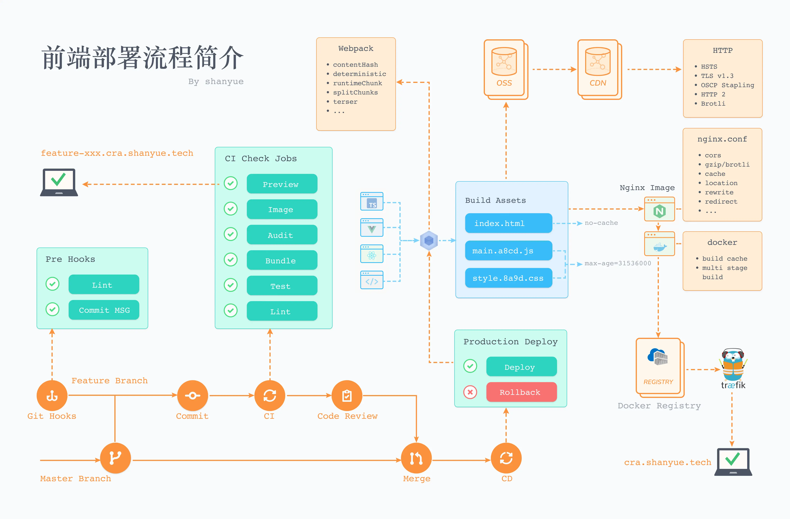

# deploy-example

- 山月小 [前端部署十五篇](https://mp.weixin.qq.com/mp/appmsgalbum?__biz=MjM5NTk4MDA1MA==&action=getalbum&album_id=2371681511445397504) 操作实践 [cra-deploy](https://github.com/shfshanyue/cra-deploy)



部署案例

- https://github.com/cloudyan/deploy-example
- https://github.com/cloudyan/deploy-example

前端部署

```bash
docker-compose up --build simple

# 强制重建容器，最新版 desktop docker 无需配置 --force-recreate
docker-compose up --build --force-recreate simple
```

最终的 `PUBLIC_URL` 为 `$Bucket.$Endpoint`

## 关于 traefik

- https://docs.traefik.cn/
- https://doc.traefik.io/traefik/

```bash
cd ./traefik

docker-compose up
```

## CI/CD

每一家 CICD 产品，都有各自的配置方式，但是总体上用法差不多。我们了解下 CICD 的基本术语

- `Runner`: 用来执行 CI/CD 的构建服务器
- `workflow/pipeline`: CI/CD 的工作流。(在大部分 CI，如 Gitlab 中为 Pipeline，而 Github 中为 Workflow，但二者实际上还是略有不同)
- `job`: 任务，比如构建，测试和部署。每个 `workflow/pipeline` 由多个 `job` 组成


```yaml
# 仅仅当 master 代码发生变更时，用以自动化部署
on:
  push:
    branches:
      - master

# 仅当 feature/** 分支发生变更时，进行 Preview 功能分支部署 (见 Preview 篇)
on:
  pull_request:
    types:
      # 当新建了一个 PR 时
      - opened
      # 当提交 PR 的分支，未合并前并拥有新的 Commit 时
      - synchronize
    branches:
      - 'feature/**'

# 在每天凌晨 0:30 处理一些事情，比如清理多余的 OSS 资源，清理多余的功能分支 Preview (见 Preview 篇)
on:
  schedule:
    - cron:  '30 8 * * *'
```

### CI

CI 流程

1. Install。依赖安装。
2. Lint。保障统一的代码风格。
3. Test。单元测试。
4. Preview。生成一个供测试人员进行检查的网址。

CI 检测时机

- 功能分支提交后（CI 阶段），进行 Build、Lint、Test、Preview 等，「如未通过 CICD，则无法 Preview，更无法合并到生产环境分支进行上线」
- 功能分支通过后（CI 阶段），合并到主分支，进行自动化部署。

分支提交或PR提交

```yaml
# 当功能分支代码 push 到远程仓库后，进行 CI
on:
  push:
    branches:
      - 'feature/**'

# 或

# 当功能分支代码 push 到远程仓库以及是 Pull Request 后，进行 CI
on:
  pull_request:
    types:
      # 当新建了一个 PR 时
      - opened
      # 当提交 PR 的分支，未合并前并拥有新的 Commit 时
      - synchronize
    branches:
      - 'feature/**'
```

通过 CI，我们可以快速反馈，并促进敏捷迭代。这要求我们使用 Git 时尽早提交以发现问题，以功能小点为单位频繁提交发现问题，也避免合并分支时发现重大冲突。

## 环境变量管理

- 在 Github Actions 中，可通过 `env` 设置环境变量，并可通过 `$GITHUB_ENV` 在不同的 Step 共享环境变量。
- 在 Github Actions 中还可以使用 `Context` 获取诸多上下文信息，可通过 `${{ toJSON(github) }}` 进行获取。

使用示例参见 `ci-env.yaml`

一个项目中的环境变量，可通过以下方式进行设置

1. 本地/宿主机拥有环境变量
2. CI 拥有环境环境变量，当然 CI Runner 可认为是宿主机，CI 也可传递环境变量 (命令式或者通过 Github/Gitlab 手动操作)
3. Dockerfile 可传递环境变量
4. docker-compose 可传递环境变量
5. kubernetes 可传递环境变量 (env、ConfigMap、secret)
6. 一些配置服务，如 [consul4](https://github.com/hashicorp/consul)、[vault5](https://github.com/hashicorp/vault)

而对于一些前端项目而言，可如此进行配置

1. 敏感数据放在 `[vault]` 或者 k8s 的 `[secket]` 中注入环境变量，也可通过 Github/Gitlab 设置中进行注入环境变量
2. 非敏感数据可放置在项目目录 `.env` 中维护
3. Git/OS 相关通过 CI 注入环境变量

有一个内置于操作系统的命令 `envsubst` 专职于文件内容的环境变量替换，如果系统中无自带 `envsubst` 命令，可使用第三方 [envsubst](https://github.com/a8m/envsubst) 进行替代。

```bash
cat preview.docker-compose.yaml | COMMIT_REF_NAME=$(git rev-parse --abbrev-ref HEAD) envsubst
```

## 基于 CICD 的多分支部署

在 Gitlab CI 中可以通过环境变量 `CI_COMMIT_REF_SLUG` 获取，该环境变量还会做相应的分支名替换，如 `feature/A` 到 `feature-a` 的转化。

在 Github Actions 中可以通过环境变量 `GITHUB_REF_NAME/GITHUB_HEAD_REF` 获取。

> **CI_COMMIT_REF_SLUG**: $CI_COMMIT_REF_NAME lowercased, shortened to 63 bytes, and with everything except 0-9 and a-z replaced with -. No leading / trailing -. Use in URLs, host names and domain names.

- github
- gitlab

## 基于 k8s 的多分支部署

1. 根据分支名作为镜像的 Tag 构建镜像。如 `cra-deploy-app:feature-A`
2. 根据带有 Tag 的镜像，对每个功能分支进行单独的 Deployment。如 `cra-deployment-feature-A`
3. 根据 Deployment 配置相对应的 Service。如 `cra-service-feature-A`
4. 根据 Ingress 对外暴露服务并对不同的 Service 提供不同的域名。如 `feature-A.cra.shanyue.tech`

参见 k8s-preview-app.yaml

## deploy 命令的封装

但是无论基于那种方式的部署，我们总是可以在给它封装一层来简化操作，一来方便运维管理，一来方便开发者直接接入。如把部署抽象为一个命令，我们这里暂时把这个命令命名为 `deploy`，`deploy` 这个命令可能基于 `kubectl/heml` 也有可能基于 `docker-compose`。

该命令最核心 API 如下：

```bash
$ deploy service-name --host :host
```

假设要部署一个应用 `cra-feature-A`，设置它的域名为 `feature-A.dev.cra.deepjs.cn`，则这个部署前端的命令为：

```bash
$ deploy cra-feature-A --host feature-A.dev.cra.deepjs.cn
```

## 初学 kubernetes，并使用 k8s 部署前端应用

前端推荐以下两种途径学习 k8s

- 在本地搭建 [minikube](https://minikube.sigs.k8s.io/docs/)
  - 在官网 [Interactive Tutorials](https://kubernetes.io/docs/tutorials/kubernetes-basics/deploy-app/deploy-interactive/) 进行学习，它提供了真实的 minikube 环境
- [Katacoda 的 Kubernetes Playground](https://www.katacoda.com/courses/kubernetes/playground)
- 其他补充资料
  - [kubernetes](https://kubernetes.io/docs/home/)
  - [helm](https://helm.sh/docs/) 是 Kubernetes 的包管理器
  - [prometheus](https://prometheus.io/docs/introduction/overview/) 是一个开源系统监控和警报工具包

### 术语

- Pod: 是 k8s 中最小的编排单位，通常由一个容器组成。
- Deployment: 可视为 k8s 中的部署单元，如一个前端/后端项目对应一个 Deployment。
  - Deployment 可以更好地实现弹性扩容，负载均衡、回滚等功能。它可以管理多个 Pod，并自动对其进行扩容。
  - [kubernetes v1.23 Deployment](https://kubernetes.io/docs/reference/generated/kubernetes-api/v1.23/#deployment-v1-apps)
  - 参看 k8s-app.yaml, 以下是字段释义
    - `spec.template`: 指定要部署的 Pod
    - `spec.replicas`: 指定要部署的个数
    - `spec.selector`: 定位需要管理的 Pod
  - 可使用 `kubectl apply` 部署生效后查看 `Pod` 以及 `Deployment` 状态
    - `kubectl apply -f k8s-app.yaml`
- Service: 可通过 `spec.selector` 匹配合适的 Deployment 使其能够通过统一的 `Cluster-IP` 进行访问。
  - 根据 `kubectl get service` 可获取 IP，在 k8s 集群中可通过 `curl 10.102.82.153` 直接访问。
  - 所有的服务可以通过 `<service>.<namespace>.svc.cluster.local` 进行服务发现。在集群中的任意一个 Pod 中通过域名访问服务
  - 对外可通过 `Ingress` 或者 `Nginx` 提供服务。

### 回滚

可以使用 `kubectl rollout` 直接进行回滚

```bash
kubectl rollout undo deployment/nginx-deployment
```

寻求更复杂的部署策略可前往 [k8s-deployment-strategies](https://github.com/ContainerSolutions/k8s-deployment-strategies)

## 常见问题

```bash
# 列举出所有容器的标签信息
$ curl --unix-socket /var/run/docker.sock http:/containers/json | jq '.[] | .Labels'
```

报错

```bash
  % Total    % Received % Xferd  Average Speed   Time    Time     Time  Current
                                 Dload  Upload   Total   Spent    Left  Speed
100    29    0    29    0     0  10772      0 --:--:-- --:--:-- --:--:-- 14500
jq: error (at <stdin>:1): Cannot index string with string "Labels"
```

文档：

- [Dockerfile Reference](https://docs.docker.com/engine/reference/builder/)
- [Compose file Reference](https://docs.docker.com/compose/compose-file/compose-file-v3/)
- Github
  - [Github Actions](https://github.com/features/actions)
    - [Github Actions 配置](https://docs.github.com/en/actions/learn-github-actions/workflow-syntax-for-github-actions)
    - [json.schema github-workflow](https://json.schemastore.org/github-workflow.json)
    - [Adding self hosted runners](https://docs.github.com/cn/actions/hosting-your-own-runners/adding-self-hosted-runners)
    - [Events that trigger workflows](https://help.github.com/en/actions/automating-your-workflow-with-github-actions/events-that-trigger-workflows#about-workflow-events)
  - [Managing a branch protection rule](https://docs.github.com/en/repositories/configuring-branches-and-merges-in-your-repository/defining-the-mergeability-of-pull-requests/managing-a-branch-protection-rule)
  - CI
    - Audit
      - 使用 npm audit 或者 [snyk](https://snyk.io/) 检查依赖的安全风险。
      - [如何检测有风险依赖](https://q.shanyue.tech/engineering/742.html#audit)
    - Quality: 使用 [SonarQube](https://www.sonarqube.org/) 检查代码质量
    - Container Image: 使用 [trivy](https://github.com/aquasecurity/trivy) 扫描容器镜像安全风险。
    - End to End: 使用 [Playwright](https://github.com/microsoft/playwright) 进行 UI 自动化测试。
    - Bundle Chunk Size Limit: 使用 [size-limit](https://github.com/ai/size-limit) 限制打包体积，打包体积过大则无法通过合并。
    - Performance (Lighthouse CI): 使用 [lighthouse CI](https://github.com/GoogleChrome/lighthouse-ci) 为每次 PR 通过 Lighthouse 打分，如打分过低则无法通过合并。
    - 针对 `git hooks` 而言，很容易通过 `git commit --no-verify` 而跳过
  - CI 优化
    - [Cache Action](https://github.com/actions/cache)
    - [Cache Examples](https://github.com/actions/cache/blob/main/examples.md#node---npm)
  - ENV
    - [Github Actions virables](https://docs.github.com/en/actions/learn-github-actions/environment-variables#default-environment-variables)
      - CI: true 标明当前环境在 CI 中
      - GITHUB_REPOSITORY: 仓库名称。例如 cloudyan/deploy-example
      - GITHUB_EVENT_NAME: 触发当前 CI 的 Webhook 事件名称
      - GITHUB_SHA: 当前的 Commit Id。3f426bdxxx
      - GITHUB_REF_NAME: 当前的分支名称。main
    - 测试、构建等工具会检测如果在 CI 中，则执行更为严格的校验。
      - `create-react-app` 中 `npm test` 在本地环境为交互式测试命令，而在 CI 中则直接执行。
      - 在本地环境构建，仅仅警告(Warn) ESLint 的错误，而在 CI 中，如果有 ESLint 问题，直接异常退出。
    - 可在本地中通过该环境变量进行更为严格的校验。比如在 git hooks 中。
      - 可使用该命令，演示在 CI 中的表现
      - `CI=true npm run test`
      - `CI=true npm run build`
  - environment 部署地址
    - [Github Actions: environment](https://docs.github.com/en/actions/using-workflows/workflow-syntax-for-github-actions#jobsjob_idenvironment)
    - [Using environments for deployment](https://docs.github.com/en/actions/deployment/targeting-different-environments/using-environments-for-deployment)
    - [Github Actions Default Environment Variables](https://docs.github.com/en/actions/learn-github-actions/environment-variables#default-environment-variables)
- Gitlab
  - [Gitlab CICD Workflow](https://docs.gitlab.com/ee/ci/introduction/index.html#basic-cicd-workflow)
  - [Gitlab CI 配置](https://docs.gitlab.com/ee/ci/yaml/gitlab_ci_yaml.html)
  - [Merge when pipeline succeeds](https://docs.gitlab.com/ee/user/project/merge_requests/merge_when_pipeline_succeeds.html)
  - ENV
    - [Gitlab CI virables](https://docs.gitlab.com/ee/ci/variables/predefined_variables.html)
      - CI: true 标明当前环境在 CI 中
      - CI_PROJECT_PATH: 仓库名称。如: cloudyan/deploy-example
      - CI_COMMIT_SHORT_SHA: 当前的 Commit Short Id。3f426bd。
      - CI_COMMIT_REF_NAME: 当前的分支名称。main
- [使用 needs 字段](https://docs.github.com/en/actions/using-workflows/workflow-syntax-for-github-actions#jobsjob_idneeds) 一个 Job 依赖另一个 Job
- react-scripts [webpack.config.js](https://github.com/facebook/create-react-app/blob/v5.0.0/packages/react-scripts/config/webpack.config.js#L765)
- [jobs.<job_id>.continue-on-error](https://docs.github.com/en/actions/using-workflows/workflow-syntax-for-github-actions#jobsjob_idcontinue-on-error)


